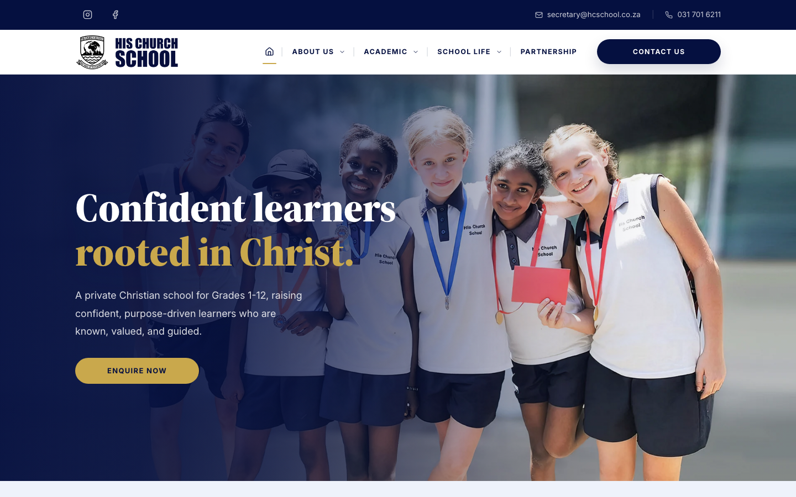

# His Church School

Static school website built to feel warm, trustworthy and handover-ready.



## Overview

His Church School is a full static marketing website for a private Christian school. It gives parents a clear route through the school's story, academics, school life, partnership opportunities and enquiry pathways.

The project is built for responsive browsing, SEO visibility and practical handover, with generated static output in `docs/` for GitHub Pages or another static host.

## My role

- UI direction
- Visual design
- Front-end implementation
- Content structure
- SEO and deployment preparation
- Client handover strategy

## Key features

- Responsive multi-page static site
- Warm homepage hero and editorial page layouts
- SEO metadata, sitemap and robots output
- Contact and enquiry pathways
- Policy downloads and calendar assets
- GitHub Pages-ready static export

## Design decisions

- Prioritised warmth, trust and readability for parents.
- Used a clear page structure to guide visitors toward enquiries.
- Added SEO metadata, policy downloads and contact pathways for handover readiness.
- Balanced school photography with generous spacing so pages feel polished without becoming heavy.

## Tech stack

React, Vite, TypeScript, Tailwind CSS, Wouter, Lucide React, pnpm.

## Live demo

[View project](https://h3ath3rv.github.io/his-church-school/)

Canonical production domain: [hcschool.co.za](https://hcschool.co.za/)

## Local development

```bash
pnpm install
pnpm dev
```

## Quality checks

```bash
pnpm check
```

Runs TypeScript checks plus image budget validation.

## Production build

```bash
pnpm build
```

This creates the static site in `docs/`, finalises route metadata, and validates the generated HTML.

## Handover notes

- Treat `client/src/` and `client/public/` as the source of truth.
- Treat `docs/` as generated output only.
- Website submissions use Formspree through `VITE_ENQUIRY_FORM_ENDPOINT`.
- Keep policy PDFs in `client/public/downloads/policies/` so families can open them easily on any device.
